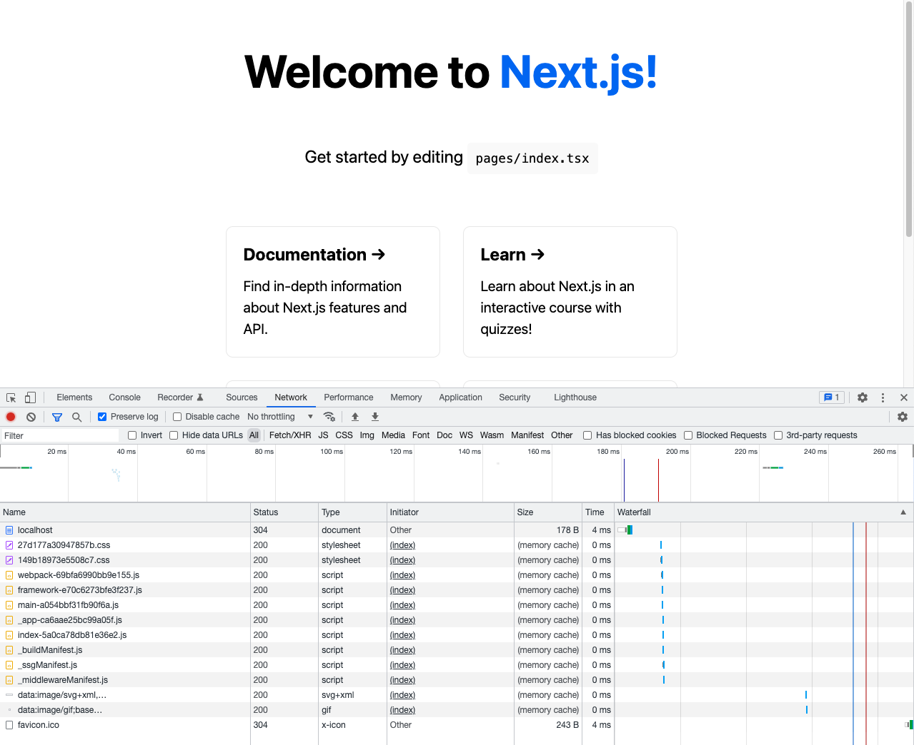

# Next JS lab

Compare NextJS to Create React App.

## Evaluation criteria

- Initial setup
- Configuration / Customization
- Routing / Pages
- Dev workflow
  - TypeScript
- Production build output
- CSS handling
- Asset handling

Client side rendering (CSR) / Server side rendering (SSR) / Static site generation (SSG).

## Create React App (CRA)

- https://create-react-app.dev/
- https://create-react-app.dev/docs/getting-started/
- https://reactjs.org/docs/create-a-new-react-app.html
  - https://reactjs.org/docs/glossary.html#single-page-application (CSR only?)
- https://create-react-app.dev/docs/adding-images-fonts-and-files
- https://create-react-app.dev/docs/code-splitting (Only router reference)
- https://create-react-app.dev/docs/pre-rendering-into-static-html-files (SSG?)

### Command history

```sh
# Check the options
npx create-react-app --help

# Create new app from typescript template
npx create-react-app --template typescript cra-example-typescript # `--template typescript` == `--template cra-template-typescript`

# Start dev
cd cra-example-typescript
PORT=4000 npm start
```

```sh
# Build production bundle
npm run build

# Any static file server will work
serve build -p 4001 # Requires `serve` to be installed (`npm install -g serve`)
```


### Result

- Without ejecting the project is fairly clean 👍

Dev workflow with all defaults.

- Live reload css works 👍
- Live reload react component works 👍
- Tests setup by default 👍
- Importing `.svg` files "just work" 👍
- `.css` can be imported 👍
- `.module.css` works as expected 👍
- Builtin storybook support?
  https://create-react-app.dev/docs/developing-components-in-isolation

Production bundle.

- Client side rendering 🤷
  - Empty html initially.
  - ... routing ...

## NextJS

Some links.

- https://nextjs.org/
- https://nextjs.org/docs/getting-started
- https://nextjs.org/learn/foundations/about-nextjs

### Command history

```sh
# Check the options
npx create-next-app@latest --help

# Create new app with typescript
npx create-next-app@latest --typescript # No <project-name> given, will be interactive

# Start dev
cd next-example-typescript
npm run dev
```

```sh
# Build production bundle
npm run build

# Server included, can be required
npm run start -- -p 5001
```



### Result

Dev workflow with all defaults.

- Live reload css works 👍
- Live reload react component works 👍
- No tests at all by default 👎
- Importing `.svg` files "just work" 👍
- `.css` can be imported 👍
- `.module.css` works as expected 👍
- No builtin storybook support 😕
- File based routing 🤯

Production bundle.

- Static site generation by default 🏎
  - Rendered html initially ⭐️
  - File based routing 🤯

Third party library.

- "Just works" 👍
  (have only tested ReactQuery)
